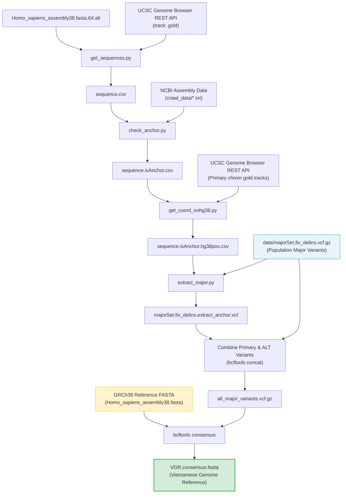

# create_concensus_genome
Script to create concensus genome
# VGR: Vietnamese Genome Reference Construction

## Step 1: get_sequences.py
Query accession from UCSC API
[](https://www.python.org/)
[](https://www.ncbi.nlm.nih.gov/assembly/GCF_000001405.26/)
[](https://github.com/VinGenome/VGR)
[](LICENSE)

## Step 2: check_anchor.py
Use data from ncbi to get which sequence is anchor or not
 
## Step 3: get_coord_onhg38.py
Search position which is anchor on hg38 to extract major 
**VGR (Vietnamese Genome Reference)** is a specialized bioinformatics pipeline designed to construct a population-specific consensus reference genome (tailored for the Vietnamese population) based on the **GRCh38 / hg38** human reference genome.

## Step 4: extract_major.py 
Extract major variants from major file and change name and pos to corresponding alt contig
---

## Step 5: 
Use bcftools consensus to replace the major variants in GRCh38 genome
## 📑 Table of Contents

- [Overview](#overview)
- [Architecture & Workflow](#architecture--workflow)
- [Repository Structure](#repository-structure)
- [Prerequisites & Installation](#prerequisites--installation)
- [Pipeline Step-by-Step Guide](#pipeline-step-by-step-guide)
  - [Step 1: Fetch ALT Contig Tiling Path (`get_sequences.py`)](#step-1-fetch-alt-contig-tiling-path-get_sequencespy)
  - [Step 2: Identify Anchored Sequence Segments (`check_anchor.py`)](#step-2-identify-anchored-sequence-segments-check_anchorpy)
  - [Step 3: Map ALT Contig Coordinates to Primary hg38 (`get_coord_onhg38.py`)](#step-3-map-alt-contig-coordinates-to-primary-hg38-get_coord_onhg38py)
  - [Step 4: Extract and Translate Major Variants for ALT Contigs (`extract_major.py`)](#step-4-extract-and-translate-major-variants-for-alt-contigs-extract_majorpy)
  - [Step 5: Generate Final Consensus Genome (`bcftools consensus`)](#step-5-generate-final-consensus-genome-bcftools-consensus)
- [Data Inputs & Specifications](#data-inputs--specifications)
- [Best Practices & Tips](#best-practices--tips)
- [References & Acknowledgments](#references--acknowledgments)

---

## 🔬 Overview

Standard human reference genomes (e.g., GRCh38 / hg38) are composite assemblies largely derived from a small number of donors of non-Asian ancestry. When analyzing genomes from specific ethnic populations, reference allele bias frequently leads to:
- Reduced mapping quality and misplaced read alignments.
- Lower sensitivity and specificity in variant calling.
- Misinterpretation of population-prevalent major alleles as rare or pathogenic variants.

**VGR** solves this problem by replacing reference alleles at high-frequency major variant loci with population-prevalent major alleles across:
1. **Primary canonical chromosomes** (`chr1`–`chr22`, `chrX`, `chrY`, `chrM`).
2. **Alternate contigs (ALT contigs)** (`chr*_alt`), by accurately projecting primary coordinates onto homologous anchored ALT regions.

---

## 📐 Architecture & Workflow



---

## 📂 Repository Structure

```text
VGR/
├── data/
│   └── majorSet.fix_delins.vcf.gz        # Curated major population variants (VCF format)
├── crawl_data/                           # NCBI assembly reports and crawled anchor files
├── Homo_sapiens_assembly38.fasta.64.alt   # ALT contig alignment definitions (GATK/BWA bundle)
├── get_sequences.py                      # Step 1: Query UCSC API for ALT contig tiling paths
├── check_anchor.py                       # Step 2: Cross-check anchored fragments against NCBI
├── get_coord_onhg38.py                   # Step 3: Compute homologous coordinate spans on hg38
├── extract_major.py                      # Step 4: Project major variants onto ALT contigs
├── .gitignore                            # Standard Python gitignore
└── README.md                             # Project documentation
```

---

## ⚙️ Prerequisites & Installation

### 1. Clone the Repository

```bash
git clone https://github.com/VinGenome/VGR.git
cd VGR
```

### 2. Python Environment

Ensure Python 3.8+ is installed. Install required Python packages:

```bash
pip install pandas requests pysam tqdm
```

Or using Conda:

```bash
conda create -n vgr python=3.10 pandas requests pysam tqdm bioconda::bcftools bioconda::samtools bioconda::tabix -y
conda activate vgr
```

### 3. Bioinformatic Tools

- **[bcftools](http://samtools.github.io/bcftools/)** (v1.12+)
- **[samtools](http://www.htslib.org/)** (v1.12+)
- **[tabix / bgzip](http://www.htslib.org/)**

---

## 🚀 Pipeline Step-by-Step Guide

### Step 1: Fetch ALT Contig Tiling Path (`get_sequences.py`)

Extracts the list of ALT contigs from `Homo_sapiens_assembly38.fasta.64.alt` and queries the UCSC Genome Browser REST API for the `gold` track (NCBI accession fragments and coordinate offsets).

```bash
python get_sequences.py
```

- **Inputs**: `Homo_sapiens_assembly38.fasta.64.alt`
- **Output**: `sequence.csv` (tab-delimited mapping of ALT contigs, fragment accessions, starts, ends, and strands).

---

### Step 2: Identify Anchored Sequence Segments (`check_anchor.py`)

Cross-references sequence fragments against NCBI assembly report files in `crawl_data/` to distinguish sequence segments anchored to primary canonical chromosomes from unanchored/novel insertions.

```bash
python check_anchor.py
```

- **Inputs**: `sequence.csv`, `crawl_data/`
- **Output**: `sequence.isAnchor.csv` (adds `anchor` indicator: `1` for anchored, `0` for unanchored).

---

### Step 3: Map ALT Contig Coordinates to Primary hg38 (`get_coord_onhg38.py`)

Calculates exact genomic coordinate intervals (`anchor_hg38_start`, `anchor_hg38_end`) on primary canonical chromosomes corresponding to each anchored ALT contig region.

```bash
python get_coord_onhg38.py
```

- **Inputs**: `sequence.isAnchor.csv`
- **Output**: `sequence.isAnchor.hg38pos.csv` (detailed cross-reference table containing coordinate spans on primary chromosomes).

---

### Step 4: Extract and Translate Major Variants for ALT Contigs (`extract_major.py`)

Extracts population major variants that fall within primary chromosome regions corresponding to anchored ALT contigs and translates their coordinates (`contig`, `pos`) to the ALT contig coordinate space.

```bash
python extract_major.py
```

- **Inputs**: `sequence.isAnchor.hg38pos.csv`, `data/majorSet.fix_delins.vcf.gz` (with its `.tbi` index)
- **Output**: `majorSet.fix_delins.extract_anchor.vcf` (major variants remapped to ALT contigs).

---

### Step 5: Generate Final Consensus Genome (`bcftools consensus`)

1. **Sort, compress, and index both VCF files**:

```bash
# Compress and index the extracted ALT contig VCF
bgzip -c majorSet.fix_delins.extract_anchor.vcf > majorSet.fix_delins.extract_anchor.vcf.gz
tabix -p vcf majorSet.fix_delins.extract_anchor.vcf.gz

# Index primary major set (if not already indexed)
tabix -p vcf data/majorSet.fix_delins.vcf.gz
```

2. **Combine primary and ALT major variants**:

```bash
bcftools concat -a \
    data/majorSet.fix_delins.vcf.gz \
    majorSet.fix_delins.extract_anchor.vcf.gz \
    -Oz -o all_major_variants.vcf.gz

tabix -p vcf all_major_variants.vcf.gz
```

3. **Apply variants to GRCh38 reference FASTA**:

```bash
bcftools consensus \
    -f Homo_sapiens_assembly38.fasta \
    all_major_variants.vcf.gz \
    > VGR.consensus.fasta
```

4. **Index the resulting consensus genome**:

```bash
samtools faidx VGR.consensus.fasta
bwa index VGR.consensus.fasta  # Optional: For BWA-MEM alignment
```

---

## 📊 Data Inputs & Specifications

| File | Description | Source / Method |
| :--- | :--- | :--- |
| `data/majorSet.fix_delins.vcf.gz` | Population-prevalent major alleles (SNVs, INDELs, DELINS) | Derived from Vietnamese cohort whole-genome sequencing (WGS) |
| `Homo_sapiens_assembly38.fasta` | Base GRCh38 human reference genome | [Broad GATK Resource Bundle](https://gatk.broadinstitute.org/hc/en-us/articles/360035890811-Resource-bundle) |
| `Homo_sapiens_assembly38.fasta.64.alt` | ALT contig mapping indices | Broad GATK Resource Bundle / BWA-KIT |
| `crawl_data/` | NCBI assembly contig definition files | NCBI Assembly database |

---

## 💡 Best Practices & Tips

- **VCF Indexing**: Ensure all VCF files are block-gzipped (`bgzip`) and indexed (`tabix`) prior to running `extract_major.py` and `bcftools concat`.
- **API Rate Limiting**: `get_sequences.py` and `get_coord_onhg38.py` query the UCSC REST API. For large-scale batch runs or offline environments, consider pre-downloading the `gold.txt.gz` table from the UCSC Golden Path directory.
- **Chromosome Nomenclature**: Ensure chromosome naming conventions (`chr1` vs `1`) are consistent across your input reference FASTA and variant VCF files.

---

## 📚 References & Acknowledgments

- **UCSC Genome Browser**: [API Documentation](https://genome.ucsc.edu/goldenPath/help/api.html)
- **GRCh38 / hg38 Assembly**: Genome Reference Consortium Human Build 38
- **HTSlib & BCFtools**: Danecek P, et al. *Twelve years of SAMtools and BCFtools*. GigaScience (2021).
- Developed by the bioinformatics team at **VinBigdata / VinGenome**.