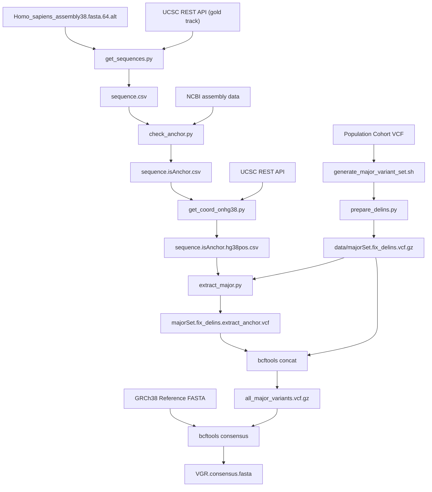

# Vietnamese Genome Reference (VGR)

A computational framework for constructing population-specific consensus human genome references with ALT-contig awareness.

## Overview

Standard human reference genomes (such as GRCh38) are composite assemblies derived primarily from individuals of non-Asian ancestry. Applying standard reference genomes directly to specific ethnic populations introduces reference allele bias, leading to reduced read alignment quality and variant calling discrepancies.

VGR addresses this by substituting reference alleles with population-prevalent major alleles across:
1. Primary canonical chromosomes (`chr1`–`chr22`, `chrX`, `chrY`, `chrM`).
2. Alternate contigs (ALT contigs, `chr*_alt`), by projecting homologous primary chromosome coordinates onto anchored ALT contig regions.

## Workflow



## Repository Structure

```text
.
├── data/
│   └── majorSet.fix_delins.vcf.gz        # Curated Vietnamese major variant set
├── Homo_sapiens_assembly38.fasta.64.alt   # ALT contig definitions
├── generate_major_variant_set.sh         # Step 0: Cohort filtering and normalization
├── prepare_delins.py                     # Step 0: InDel left-alignment and standardization
├── get_sequences.py                      # Step 1: Query UCSC API for ALT tiling paths
├── check_anchor.py                       # Step 2: Identify anchored contig segments
├── get_coord_onhg38.py                   # Step 3: Map ALT segments to primary coordinates
├── extract_major.py                      # Step 4: Remap major variants to ALT contigs
├── build_consensus.sh                    # Step 5: Merge variants and build consensus FASTA
├── run_pipeline.sh                       # End-to-end pipeline runner
├── bwa-postalt.js                        # BWA postalt script for ALT-aware mapping
└── README.md
```

## Requirements

- Python 3.8+ with `pandas`, `requests`, `pysam`, `tqdm`
- `bcftools` (v1.12+)
- `samtools` (v1.12+)
- `tabix` / `bgzip`

```bash
conda create -n vgr python=3.10 pandas requests pysam tqdm bioconda::bcftools bioconda::samtools bioconda::tabix -y
conda activate vgr
```

## Pipeline Guide

### Step 0: Prepare Population Major Variant Set (Optional)

If starting from a raw joint-called cohort VCF:
1. Filters PASS variants (VQSR tranche).
2. Decomposes multiallelic sites and left-aligns indels (`bcftools norm`).
3. Re-annotates allele frequencies and filters Hardy-Weinberg equilibrium ($p > 3.4 \times 10^{-6}$).
4. Extracts major alleles with $\text{AF} \ge 0.50$.
5. Standardizes indels/delins and resolves overlapping loci (`prepare_delins.py`).

```bash
bash generate_major_variant_set.sh cohort.vcf.gz Homo_sapiens_assembly38.fasta data/
```

Output: `data/majorSet.fix_delins.vcf.gz`

*(Note: Precomputed Vietnamese major alleles are already provided in `data/majorSet.fix_delins.vcf.gz`.)*

### Step 1: Query ALT Contig Tiling Paths

Extracts ALT contigs and retrieves tiling path coordinates from UCSC Genome Browser API:

```bash
python3 get_sequences.py --alt Homo_sapiens_assembly38.fasta.64.alt --output sequence.csv
```

Output: `sequence.csv`

### Step 2: Identify Anchored Contig Segments

Cross-references ALT fragments against primary chromosome tiling tracks to distinguish anchored segments:

```bash
python3 check_anchor.py --input sequence.csv --output sequence.isAnchor.csv
```

Output: `sequence.isAnchor.csv`

### Step 3: Map Coordinates to Primary Reference

Computes homologous primary chromosome coordinate spans for each anchored segment:

```bash
python3 get_coord_onhg38.py --input sequence.isAnchor.csv --output sequence.isAnchor.hg38pos.csv
```

Output: `sequence.isAnchor.hg38pos.csv`

### Step 4: Project Major Variants onto ALT Contigs

Extracts primary chromosome major variants and projects their positions onto corresponding ALT contigs:

```bash
python3 extract_major.py \
    --coords sequence.isAnchor.hg38pos.csv \
    --vcf data/majorSet.fix_delins.vcf.gz \
    --output majorSet.fix_delins.extract_anchor.vcf
```

Output: `majorSet.fix_delins.extract_anchor.vcf`

### Step 5: Build Final Consensus Genome

Merges variants, applies them to the GRCh38 FASTA with `bcftools consensus`, and generates FASTA indices (`.fai`, `.dict`, `.alt`):

```bash
bash build_consensus.sh \
    data/majorSet.fix_delins.vcf.gz \
    majorSet.fix_delins.extract_anchor.vcf \
    Homo_sapiens_assembly38.fasta \
    VGR.consensus.fasta
```

Output: `VGR.consensus.fasta`

---

## One-Command Execution

To run all steps in sequence:

```bash
# Using precomputed major variants:
bash run_pipeline.sh --ref Homo_sapiens_assembly38.fasta --output VGR.consensus.fasta

# From raw cohort WGS VCF:
bash run_pipeline.sh --cohort cohort.vcf.gz --ref Homo_sapiens_assembly38.fasta --output VGR.consensus.fasta
```

## Citation

VinBigdata / VinGenome Bioinformatics Team.
